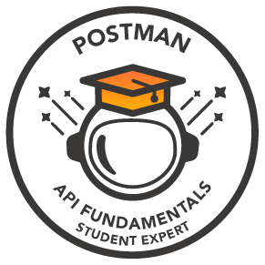

  <h1>
    
  </h1>

---

## 🚀 About Me

<table>
<tr>
<td width="50%" valign="top">

🎓 **Pre-final year Computer Science student** at IIIT Pune.

💻 Passionate about building **scalable backend applications** & solving real-world problems.

🚀 **Tech Stack:** Python, C++, Django, FastAPI, React, PostgreSQL, Docker, Git

🤖 Currently exploring **Agentic AI, LLM Applications, System Design, and DevOps**.

🧩 Solved **500+ DSA problems** across coding platforms.

🌱 Learning **Kubernetes, CI/CD, Cloud, and Distributed Systems**.

🤝 Open to collaborating on **Backend, AI, and Open Source** projects.

⚡ **Fun Fact:** I love turning complex ideas into simple, production-ready solutions.

</td>

<td width="50%" align="center">

</td>
</tr>
</table>

---

<h3 align="left">Connect with me:</h3>

---

###  &nbsp; Languages and Tools:

---
      
## GSSOC Badges 🪶

    
    

---

### 🔝 Top Contributed Repo

---
<h2><i>Github Analytics</i></h2>

  

  <h3> Git Stats </h3>
  <table>
    <tr>
      <td>
        
      </td>
      <td>
          
      </td>
    </tr>
  </table>

 
 

  

  
 

<table>
  <tr>
    <td>
      
    </td>
    <td>
      
    </td>
    <td>
      
    </td>
  </tr>
</table>

---

### 🏅 GitHub Trophies

  

---

### ✍️ Random Dev Quote

  

